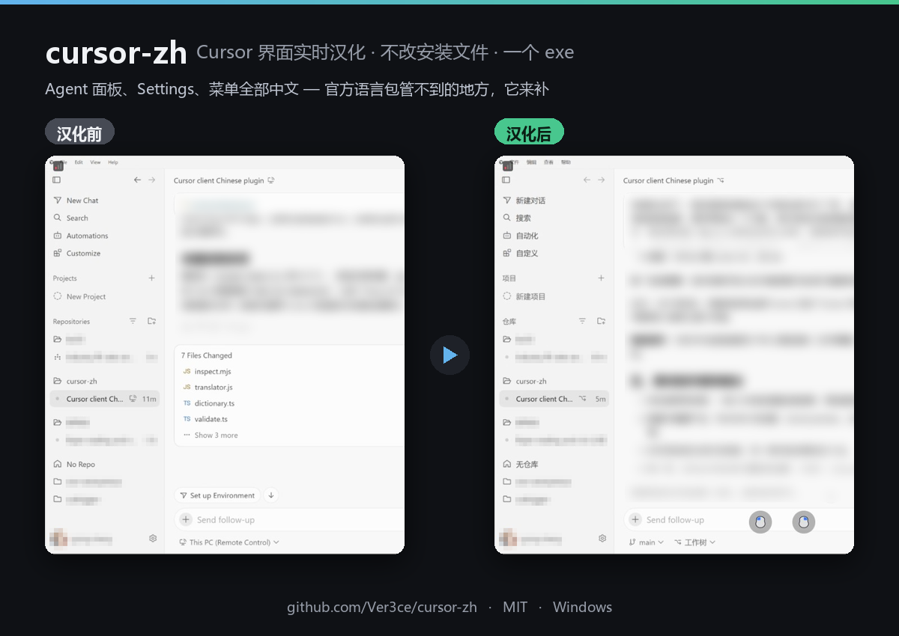
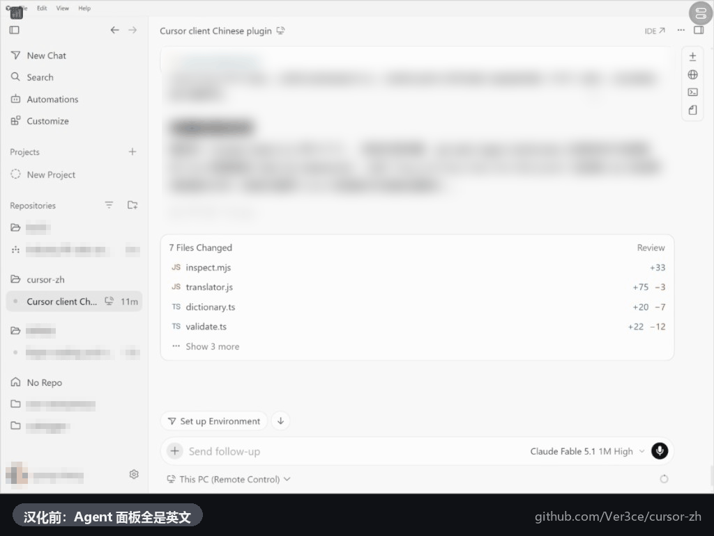

# cursor-zh — Cursor 界面中文化（运行时注入，不改安装文件）

[](https://github.com/Ver3ce/cursor-zh/actions/workflows/ci.yml)
[](https://github.com/Ver3ce/cursor-zh/releases/latest)
[](LICENSE)





把 Cursor 自研的界面——Agent/Chat 面板、Agent 窗口、Cursor Settings、内置浏览器、更改面板等——在运行时替换为中文。
这些区域是 VS Code 官方中文语言包覆盖不到的；本工具与官方语言包配合，实现整个 Cursor 界面的中文化。

**一句话原理**：以 Chromium 标准调试参数启动 Cursor，通过 DevTools 协议向每个窗口注入一段只读写 DOM 文本的脚本，按本地词典替换。
**不做的事**：不修改 Cursor 安装目录下任何文件，不改 JS 包，不发任何网络请求（除用户手动执行 `update-dict`），不调用翻译 API。

## 快速开始（3 步）

1. 到 [Releases](https://github.com/Ver3ce/cursor-zh/releases/latest) 下载 `cursor-zh.exe`，放到任意文件夹（例如 `D:\Tools\cursor-zh\`）。
2. 双击 `cursor-zh.exe`（Cursor 正在运行也没关系，程序会询问是否帮你重启它）。首次运行会进入向导：自动找到 Cursor、安装官方中文语言包、在桌面创建快捷方式「Cursor (中文)」。全程回车即可。
3. 之后每次用桌面的「Cursor (中文)」启动 Cursor。

Windows SmartScreen 可能提示"未知发布者"，这是因为 exe 未做代码签名（签名证书需付费）。点"更多信息 → 仍要运行"，或用 Release 附带的 `SHA256SUMS.txt` 校验文件。

> 需要 Node.js 的源码运行方式、命令行参数、词典维护见 [docs/使用指南.md](docs/使用指南.md)。

## 效果范围

| 区域 | 由谁负责 | 状态 |
|---|---|---|
| 菜单、命令面板、文件树、通用设置等 VS Code 底座 | 官方语言包（向导代装） | 官方支持 |
| Agent/Chat 面板、Agent 窗口、模式与模型菜单 | cursor-zh 词典 | 已覆盖常用文案 |
| Cursor Settings 全部页面 | cursor-zh 词典 | 已覆盖常用文案 |
| 内置浏览器、更改/Git 面板、快捷键列表 | cursor-zh 词典 | 已覆盖常用文案 |
| 代码编辑器、终端、你输入的内容、AI 回复正文 | 有意不翻译 | — |
| 模型名、字体名、快捷键、文件名 | 有意不翻译 | — |

词典约 1400 条精确词 + 100 条正则模板，随 Cursor 更新会出现新的英文文案。补词方式见下文"参与贡献"。

## 工作原理

```
cursor-zh.exe ──启动──▶ Cursor.exe --remote-debugging-port=9333（仅监听 127.0.0.1）
      │
      └──CDP (WebSocket)──▶ 发现所有窗口/iframe/webview
                              │
                              └── 注入 translator.js + 词典
                                    ├─ 遍历文本节点与 title/aria-label/placeholder/alt
                                    ├─ 精确匹配 → 大小写不敏感 → 正则模板
                                    ├─ MutationObserver 跟踪 React 增量渲染
                                    └─ 记录 {原文, 译文}，词典热更新时按原文重译
```

- 注入脚本只写 `Text.nodeValue` 和四个普通属性，不触碰 `innerHTML`/`eval` 等 Trusted Types 受控 sink，因此不受 Cursor workbench 的 CSP 限制。
- 跳过 Monaco 编辑器、终端、`contenteditable` 输入区、`pre/code`、Markdown 正文。
- 词典文件保存后 1 秒内自动热更新，无需重启。

## 风险与限制（请阅读）

| 项目 | 说明 |
|---|---|
| 不触发 "installation appears to be corrupt" | 没有改任何安装文件；Cursor 自动更新后本工具继续工作（个别词条可能因文案变更而回落英文）。 |
| 服务条款 | 本工具只读写本机 Cursor 窗口的 DOM，不接触网络协议或账户系统。是否违反 Cursor 服务条款、服务端能否感知，**没有公开证据能证明或否定**。这是未验证的风险，由使用者自行评估。 |
| 本机安全面 | 调试端口开放期间，**本机任何进程**都可以连接该端口控制 Cursor 窗口（含读取页面内容）。端口只绑定 `127.0.0.1`，外部网络不可达。若机器上运行不可信软件，请勿使用。 |
| 显示语言设置 | 向导会（在你确认后）把 `%USERPROFILE%\.cursor\argv.json` 的 `locale` 设为 `zh-cn`。这是用户配置文件而非安装文件，修改前自动备份；`uninstall --restore-locale` 可还原。 |
| 误翻 | 只有词典中的短语会被替换，AI 回复、代码、文件名基本不受影响；但极短的通用词（如 `Plan`）在个别位置可能语义不符。 |
| 平台 | 目前仅 Windows。exe 未签名；体积约 80 MB（内含 Node 运行时）。 |

## 参与贡献

最有价值的贡献是**补词**：

1. 运行时在控制台按 `c` 回车（或 `cursor-zh.exe collect`），得到 `dict/untranslated.json`——所有出现过但未收录的英文。
2. 翻译后加入 `dict/zh-CN.json` 的 `exact`；含数字/变量的写进 `patterns`。
3. `npm run validate-dict` 通过后提 PR。CI 会自动校验 JSON、重复键、正则。

详见 [CONTRIBUTING.md](CONTRIBUTING.md)。

## 卸载

`cursor-zh.exe uninstall`（可加 `--restore-locale`），然后删除 exe 所在文件夹。Cursor 本体从未被改动。

## 致谢与相关项目

- VS Code 官方简体中文语言包 `MS-CEINTL.vscode-language-pack-zh-hans`
- 社区语言包 `polang233.cursor-language-pack`（走 NLS 机制，覆盖 Cursor 写进 NLS 的字串）
- 注入 `workbench.html` 路线的项目（如 `vibepm666/cursor-localization-zh`）——本项目选择不改文件的 CDP 路线，权衡见上表

## License

[MIT](LICENSE)

---

## English

**cursor-zh** localizes Cursor's proprietary UI (Agent/Chat panel, Agent window, Cursor Settings, built-in browser, Changes panel) into Simplified Chinese at runtime — without modifying any installed file.

It launches Cursor with the standard Chromium flag `--remote-debugging-port` (bound to `127.0.0.1` only), connects over the DevTools Protocol, and injects a small script into every window that replaces DOM text nodes and `title`/`aria-label`/`placeholder`/`alt` attributes using a local dictionary. No network requests are made unless you explicitly run `update-dict`.

Download `cursor-zh.exe` from Releases, quit Cursor, double-click the exe, follow the first-run wizard. Windows only for now. The exe is unsigned (SmartScreen warning); verify with `SHA256SUMS.txt`.

Read the risk section above before use: whether this is compatible with Cursor's Terms of Service has not been verified either way, and while the debug port is open any local process can control the Cursor window.
